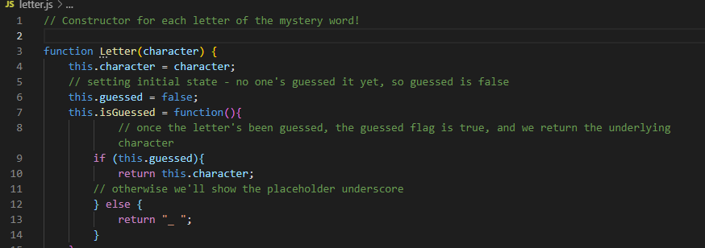
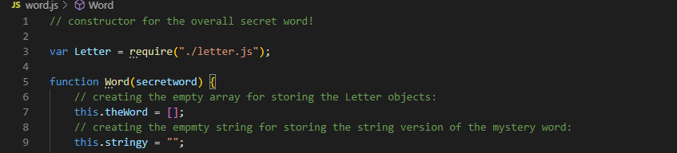

# constructor-wordguess
Node CLI word guess game!
Repository link: https://github.com/noracbyrd/constructor-wordguess

# Disney Word Guess CLI Game!

### Overview

This is your basic hangman game played entirely within the command line interface. A Disney-themed word is selected at random from an array of options, and the user guesses letters until they either run out of turns or guess the entire word correctly.

### Game Demo
https://drive.google.com/file/d/1ppn_3BD-5gqNkl5Un-RcBuIGVDAP2xzt/view

### Game Structure

The game is built from a series of constructors. When a mystery word is selected at random, the Word constructor is called to create a new Word, which in turn calls a Letter constructor for each letter in the word. Using constructors allows the individual letters to have functions to check themselves against the user guess, and it allows us to store both the mystery word and word-in-progress the user sees in their interface. The overall game depends on the secret word generator and the Word constructor, which in turn depends on the Letter constructor.

### A Note on Spaces

The game accounts for mystery words that have spaces! E.g., Beauty and the Beast. Every method in the Word constructor has a condition for if a space character is included in the word.

### Technology
* Node
* Inquirer

### Previews
* Letter constructor: 

* Word constructor: 

### Future Improvements
* There should really be a validation check to make sure the user is only entering letters. Currently, entering a number or special character just counts as a wrong guess; the game doesn't break, but it would be nicer not to make a player lose a turn for a stray keystroke!
* Since the words are chosen at random, it's possible that the user could have to guess the same word multiple times. I think the way I would fix this is to make each mystery word an object with a name property (the word itself) and a "guessed" property, which would be a boolean flag of whether or not the word had turned up. When the random word is being selected, it would check to see if the word had been used already, and if not (guessed="false"), run the game with that word as the mystery word. Then, when a user either runs out of turns or guesses the word, the flag would switch to guessed = true. The game would end when all the words' guessed properties equal true. 

